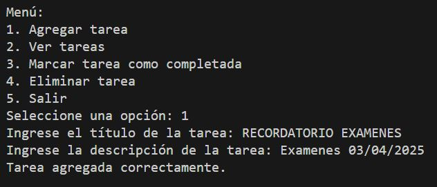
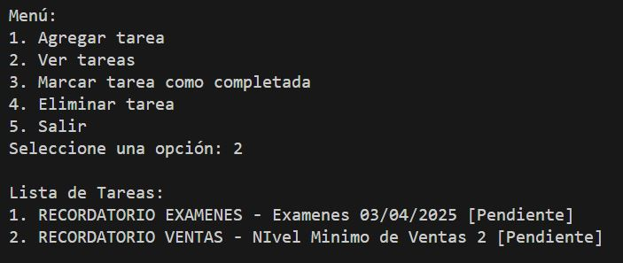
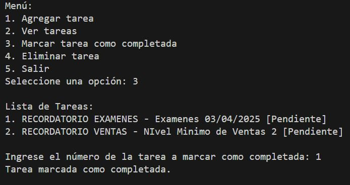
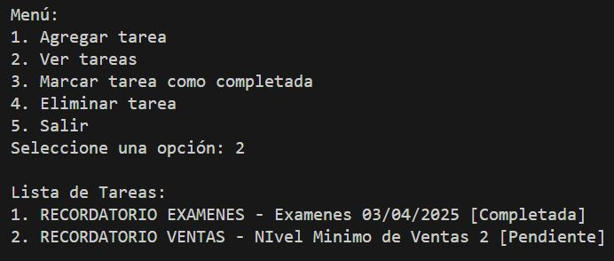
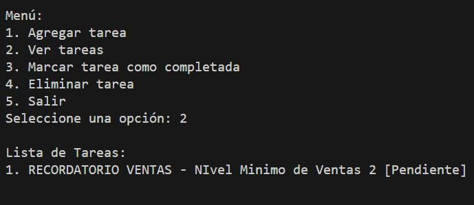

# ACTIVIDAD 3 - EJERCICIO 1 / Sistema de Gestión de Tareas

## 📏 Descripción
El objetivo de este proyecto es crear un sistema simple de gestión de tareas donde los usuarios puedan agregar, eliminar, y ver tareas. Cada tarea tendrá un título, una descripción y un estado (pendiente o completada).

## 📌 Requisitos
- **Variables:** Para almacenar información de las tareas.
- **Listas:** Para mantener un registro de todas las tareas.
- **Condicionales:** Para manejar las opciones del menú y el estado de las tareas.
- **Ciclos:** Para mostrar el menú y permitir múltiples operaciones hasta que el usuario decida salir.

## 🚀 Funcionalidades
- 📝 **Agregar Tarea:** Permite al usuario agregar una nueva tarea con un título y una descripción.
- ❌ **Eliminar Tarea:** Permite al usuario eliminar una tarea existente.
- 📋 **Ver Tareas:** Muestra todas las tareas con su estado.
- ✅ **Marcar Tarea como Completada:** Permite al usuario marcar una tarea como completada.
- **Salir:** Termina el programa.
- 🔚 **Menú Principal:** Un ciclo que muestra las opciones disponibles y solicita la elección del usuario.
- **Estructura del Código

## Estructura
- **/EJERCICIO 1**
    - main.py **Archivo Principal con el menú**
    - funciones.py **Funciones del programa** 
    - README.md **Documentacipon del proyecto**

## Ejecuion
- **Menú**


- **Agregar Tareas**


- **Ver Tareas**


- **Marcar Tareas Como Completadas**



- **Eliminar Tareas**



- **Salir Del Programa**


## Video Sustentación
- **[Video YouTube](https://youtu.be/3zfOrpf30SY)**

## Explicacion Codigo

- main.py **Tenemos la navegacion sobre el menú principal y determina cual opcion se ejecutara junto con su funcion**

### Seimportan las funciones de la ruta funciones.py
```python
import funciones
```

### Se inicia con una funcion menu() e imprime las opciones que se van a asignar.
```python
def menu():
    while True:
        print("\nMenú:")
        print("1. Agregar tarea")
        print("2. Ver tareas")
        print("3. Marcar tarea como completada")
        print("4. Eliminar tarea")
        print("5. Salir")
```

### segun la informacion que ingresa el usuario vamos a enviarlo por el if-elif-else a cada una de las funciones establecidas
```python
if opcion == "1":
            funciones.agregar_tarea()
        elif opcion == "2":
            funciones.ver_tareas()
        elif opcion == "3":
            funciones.marcar_completada()
        elif opcion == "4":
            funciones.eliminar_tarea()
        elif opcion == "5":
            print("Saliendo del programa...")
            break
        else:
            print("Opción inválida, intente de nuevo.\n")
```

### Funciones
-**Agregar Tareas**
```python
def agregar_tarea():
    titulo = input("Ingrese el título de la tarea: ")
    descripcion = input("Ingrese la descripción de la tarea: ")
    tarea = {"titulo": titulo, "descripcion": descripcion, "estado": "Pendiente"}
    tareas.append(tarea)
    print("Tarea agregada correctamente.\n")
```

-**Ver Tareas**
```python
def ver_tareas():
    if not tareas:
        print("No hay tareas registradas.\n")
        return
    print("\nLista de Tareas:")
    for i, tarea in enumerate(tareas, 1):
        print(f"{i}. {tarea['titulo']} - {tarea['descripcion']} [{tarea['estado']}]")
    print("")
```

-**Marcar Tareas Como Completadas**
```python
def marcar_completada():
    ver_tareas()
    if not tareas:
        return
    try:
        num = int(input("Ingrese el número de la tarea a marcar como completada: "))
        if 1 <= num <= len(tareas):
            tareas[num - 1]["estado"] = "Completada"
            print("Tarea marcada como completada.\n")
        else:
            print("Número inválido.\n")
    except ValueError:
        print("Por favor, ingrese un número válido.\n")
```

-**Eliminar Tareas**
```python
def eliminar_tarea():
    ver_tareas()
    if not tareas:
        return
    try:
        num = int(input("Ingrese el número de la tarea a eliminar: "))
        if 1 <= num <= len(tareas):
            tarea_eliminada = tareas.pop(num - 1)
            print(f"Tarea '{tarea_eliminada['titulo']}' eliminada.\n")
        else:
            print("Número inválido.\n")
    except ValueError:
        print("Por favor, ingrese un número válido.\n")
```