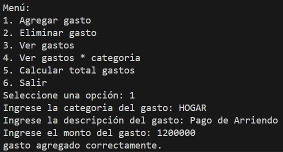
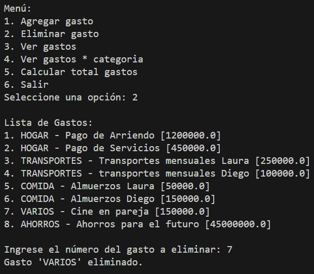
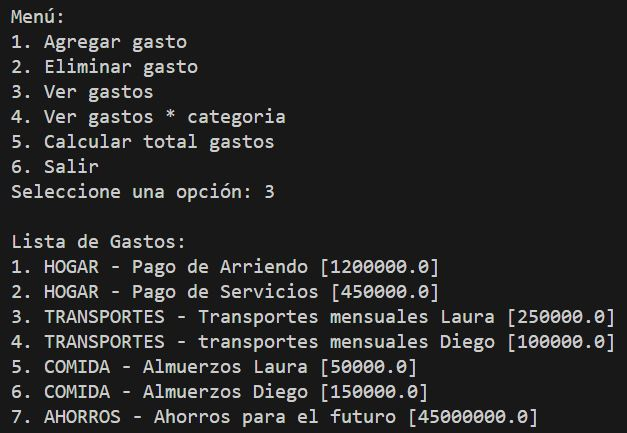
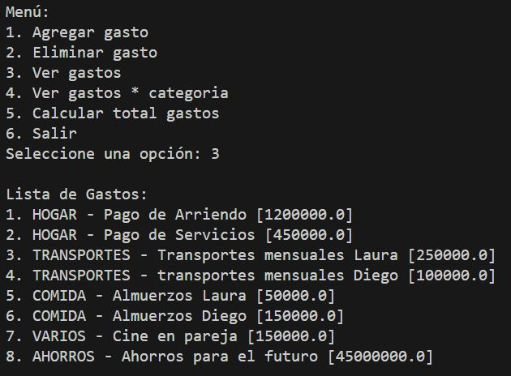
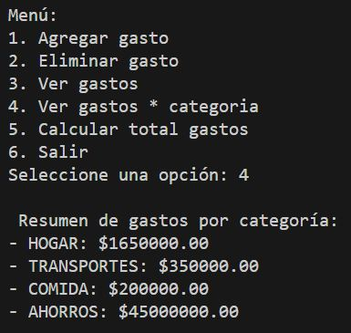
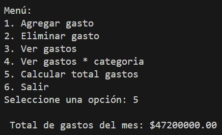
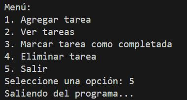

# ACTIVIDAD 3 - EJERCICIO 2 / Calculadora de Gastos Mensuales

## 📏 Descripción
El objetivo de este proyecto es crear una calculadora que ayude a los usuarios a gestionar sus gastos mensuales. El programa permitirá al usuario ingresar diferentes tipos de gastos y calculará el total de gastos al final del mes. También podrá categorizar los gastos y mostrar un resumen por categoría.

## 📌 Requisitos
- **Variables:** Para almacenar información de los gastos.
- **Listas:** Para mantener un registro de todos los gastos.
- **Condicionales:** Para manejar las opciones del menú y las categorías de gastos.
- **Ciclos:** Para permitir múltiples entradas de gastos y mostrar el menú hasta que el usuario decida salir.

## 🚀 Funcionalidades
- 📝 **Agregar Gasto:** Permite al usuario agregar un nuevo gasto con una descripción, categoría y monto.
- ❌ **Eliminar Gasto:** Permite al usuario eliminar un gasto existente.
- 📋 **Ver Gastos:** Muestra todos los gastos ingresados.
- 📋 **Ver Resumen Por Categoría:** Muestra un resumen de los gastos agrupados por categoría.
- ✅ **Calcular Total De Gastos:** Calcula y muestra el total de todos los gastos ingresados.
- **Salir:** Termina el programa.
- 🔚 **Menú Principal:** Un ciclo que muestra las opciones disponibles y solicita la elección del usuario.
- **Estructura del Código

## ⚡ Funciones
- 📝 **agregar_gasto():** Para agregar un nuevo gasto.
- ❌ **eliminar_gasto():** Para eliminar un gasto existente.
- 📋 **ver_gastos():** Para mostrar todos los gastos.
- 📋 **ver_resumen_categoria():** Para mostrar un resumen de los gastos por categoría.
- ✅ **calcular_total_gastos():** Para calcular el total de los gastos.

## Estructura
- **/EJERCICIO 1**
    - main.py **Archivo Principal con el menú**
    - funciones.py **Funciones del programa** 
    - README.md **Documentacipon del proyecto**

## Ejecuion
- **Menú**


- **Agregar Gastos**


- **Eliminar Gastos**



- **Ver Gastos**


- **Ver Gastos Por Categoria**


- **Gastos Total**


- **Salir Del Programa**


## Video Sustentación
- **[Video YouTube](https://)**

## Explicacion Codigo

- main.py **Tenemos la navegacion sobre el menú principal y determina cual opcion se ejecutara junto con su funcion**

### Seimportan las funciones de la ruta funciones.py
```python
import funciones
```

### Se inicia con una funcion menu() e imprime las opciones que se van a asignar.
```python
def menu():
    while True:
        print("\nMenú:")
        print("1. Agregar gasto")
        print("2. Eliminar gasto")
        print("3. Ver gastos")
        print("4. Ver gastos * categoria")
        print("5. Calcular total gastos")
        print("6. Salir")
```

### El usuario ingresa la opcion que necesita procesar desde el input.
```python
opcion = input("Seleccione una opción: ")
```

### Segun el valor ingresado lo iteramos desde el if-elif-else a cada una de las funciones correspondientemente.
```python
if opcion == "1":
            funciones.agregar_gasto()
        elif opcion == "2":
            funciones.eliminar_gasto()    
        elif opcion == "3":
            funciones.ver_gastos()
        elif opcion == "4":
            funciones.ver_resumen_categoria()
        elif opcion == "5":
            funciones.calcular_total_gastos()
        elif opcion == "6":
            print("Saliendo del programa...")
            break
        else:
            print("Opción inválida, intente de nuevo.\n")
```

### Funciones
-**Agregar Gasto**
```python
def agregar_gasto():
    categoria = input("Ingrese la categoria del gasto: ")
    descripcion = input("Ingrese la descripción del gasto: ")
    monto = float(input("Ingrese el monto del gasto: "))
    gasto = {"categoria": categoria, "descripcion": descripcion, "monto": monto}
    gastos.append(gasto)
    print("gasto agregado correctamente.\n")
```

-**Eliminar Gastos**
```python
def eliminar_gasto():
    ver_gastos()
    if not gastos:
        return
    try:
        num = int(input("Ingrese el número del gasto a eliminar: "))
        if 1 <= num <= len(gastos):
            gasto_eliminada = gastos.pop(num - 1)
            print(f"Gasto '{gasto_eliminada['categoria']}' eliminado.\n")
        else:
            print("Número inválido.\n")
    except ValueError:
        print("Por favor, ingrese un número válido.\n")
```

-**Ver Gastos**
```python
def ver_gastos():
    if not gastos:
        print("No hay gastos registrados.\n")
        return
    print("\nLista de Gastos:")
    for i, gasto in enumerate(gastos, 1):
        print(f"{i}. {gasto['categoria']} - {gasto['descripcion']} [{gasto['monto']}]")
    print("")
```

-**Ver Resumen De Gastos Por Categoria**
```python
def ver_resumen_categoria():
    resumen={}

    if not gastos:
        print("No hay gastos registrados.\n")
        return
    for gasto in gastos:
        categoria = gasto['categoria']
        monto = gasto['monto']
        if categoria in resumen:
            resumen[categoria] += monto
        else:
            resumen[categoria] = monto
    print("\n Resumen de gastos por categoría:")
    for categoria, total in resumen.items():
        print(f"- {categoria}: ${total:.2f}")
    print()
```

-**Calcular Total De Los Gastos**
```python
def calcular_total_gastos():

    if not gastos:
        print("No hay gastos registrados.\n")
        return
    total = sum(gasto['monto'] for gasto in gastos)
    print(f"\n Total de gastos del mes: ${total:.2f}\n")
```